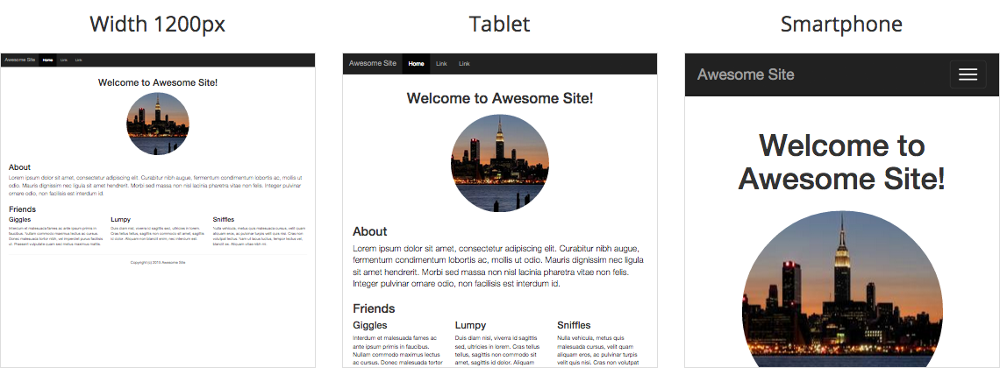

# Dyframe
> Dynamically render scaled HTML into iframe

[](http://htanjo.github.io/dyframe/demo/)

[**See demo**](http://htanjo.github.io/dyframe/demo/)

## Getting started
### Install

Download and include `dyframe.js` to your HTML.
Available on [Bower](http://bower.io/) and [npm](https://www.npmjs.com/).

* Download: [**dyframe.js**][uncompressed-url] / [minified][minified-url]
* Bower: `$ bower install dyframe --save`
* npm: `$ npm install dyframe --save`

### Example
```html
<!doctype html>
<html>
  <head>
    <meta charset="utf-8">
    <title>Dyframe</title>
    <style>
      #dyframe {
        width: 360px;
        height: 480px;
        border: 1px solid #ddd;
      }
    </style>
  </head>
  <body>
    <div id="dyframe"></div>
    <script src="dyframe.js"></script>
    <script>
      var element = document.getElementById('dyframe');
      new Dyframe(element, {
        html: '<html><body>Hello, world!</body></html>'
      });
    </script>
  </body>
</html>
```

## Usage
```js
new Dyframe(element, options);
```

- `element`: Target DOM element.
- `options`: Options for rendering the HTML content.

## Options
### html
Type: `String`  
Default: `''`

HTML code to render.

### width
Type `Number`  
Default: `980` (px)

Width for HTML preview scaling.  
If `profile` option is specified, this value will be ignored. (See below)

### profile
Type: `String`  
Default: `''`

Profile name for device emulation.  
If you set proper profile, the scaling of HTML will be emulated according to `<meta name="viewport">`.

Supported profiles: `'smartphone'`, `'tablet'`

## API
You can access to programatic API. Example:

```js
var element = document.getElementById('dyframe');

// Create "dyframe" object
var dyframe = new Dyframe(element, {
  html: '<html><body>Hello, world!</body></html>'
});

setTiemout(funciton () {

  // Re-render using new options
  dyframe.render({
    html: '<html><body>Updated!</body></html>'
  });

}, 1000);
```

### .render()
Usage: `.render([options])`

Re-render the preview content.  
If you set options to this method, options will be overriden and re-render.

## License
Copyright (c) 2015 Tanjo, Hiroyuki. Licensed under the [MIT License](LICENSE).

[uncompressed-url]: https://github.com/htanjo/dyframe/raw/v0.1.0/dyframe.js
[minified-url]: https://github.com/htanjo/dyframe/raw/v0.1.0/dyframe.min.js
