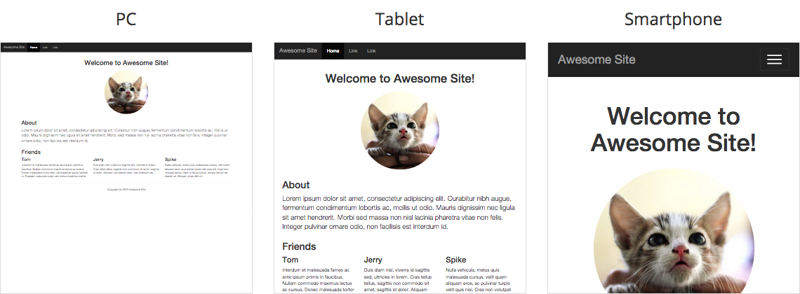

# Dyframe
> Dynamically render responsive HTML into iframe.

[![Bower Version][bower-image]][bower-url]
[![npm Version][npm-image]][npm-url]
[![Build Status][travis-image]][travis-url]
[![Coverage Status][coveralls-image]][coveralls-url]

[](http://htanjo.github.io/dyframe/)

[**See demo**](http://htanjo.github.io/dyframe/)

## Getting started
### Install

Download and include `dyframe.js` to your HTML.
Available on [Bower](http://bower.io/) and [npm](https://www.npmjs.com/).

* Download: [**dyframe.js**][uncompressed-url] / [minified][minified-url]
* Bower: `$ bower install dyframe --save`
* npm: `$ npm install dyframe --save`

### Example
```html
<!doctype html>
<html>
  <head>
    <meta charset="utf-8">
    <title>Dyframe</title>
    <style>
      #dyframe {
        width: 360px;
        height: 480px;
        border: 1px solid #ddd;
      }
    </style>
  </head>
  <body>
    <div id="dyframe"></div>
    <script src="dyframe.js"></script>
    <script>
      var element = document.getElementById('dyframe');
      new Dyframe(element, {
        html: '<html><body>Hello, world!</body></html>'
      });
    </script>
  </body>
</html>
```

## Constructor
```js
new Dyframe(element, [options]);
```

- `element` : Target DOM element.
- `options` : Options for rendering HTML content.

### Options

#### html
Type: `String`  
Default: `''`

HTML to render.  
Set whole HTML code including `doctype`, `<html>`, `<head>` and `<body>` tag.

#### width
Type `Number`  
Default: `980` (px)

Width for HTML rendering.  
But if you have `profile` option, `width` value will be ignored. (See below)

#### deviceWidth
Type `Number` | `null`  
Default: `null` (px)

Device width for HTML rendering.  
The HTML scaling can be emulated based on `<meta name="viewport">` when you set number.  
But if you have `profile` option, `deviceWidth` value will be ignored. (See below)

#### profile
Type: `String` | `null`  
Default: `null`

Profile name for device emulation.  
When you set proper profile, the scaling will be emulated using profile setting instead of `width` and `deviceWidth` option.

You can use the following profiles, or create custom profile using `Dyframe.addProfile()`.

- **smartphone:**  
  width: 980, deviceWidth: 375. Same as iPhone 6 portrait.
- **tablet:**  
  width: 980, deviceWidth: 768. Same as iPad Air 2 portrait.

**Tip:** Profiled element has additional class `df-profile-<name>`.
It can be helpful for styling with CSS.

#### interval
Type: `Number`  
Default: `0` (ms)

Interval to skip rendering.  
Frequent re-rendering, such as [live HTML preview](http://htanjo.github.io/dyframe/), could put heavy load on CPU.
To prevent that, you can limit the frequency using this option.

When you set `500` to this option, the actual DOM rendering takes place only once in 500 ms even if `.render()` method called many times.

## Methods
Create "dyframe" object before using methods.

```js
var dyframe = new Dyframe(element, options);
```

### .render([options])
Re-render the preview content.  
If you call this method with argument, the options will be overriden and re-render.

```js
var element = document.getElementById('dyframe');
var dyframe = new Dyframe(element, {
  html: '<html><body>Hello, world!</body></html>'
});

setTiemout(funciton () {

  // Update HTML content
  dyframe.render({
    html: '<html><body>Updated!</body></html>'
  });

}, 1000);
```

### .destroy()
Clean up the target element.

## Customizing

### Dyframe.addProfile(name, profile)
Add custom device profile to the Dyframe global config.

#### name
Type: `String`

Custom profile name.

#### profile
Type: `Object`

Custom profile data.
Need to define `width` and `deviceWidth` property.

```js
// Add custom profile
Dyframe.addProfile('nexus-6', {
  width: 980,
  deviceWidth: 412
});

// Render using "nexus-6" profile
new Dyframe(element, {
  html: '<html><body>Hello, world!</body></html>',
  profile: 'nexus-6'
});

```

## Compatibility

### Browser support
Dyframe works on most modern browsers including smart devices.  
[Tested](https://saucelabs.com/u/dyframe) on the following browsers:

- Internet Explorer (9+)
- Chrome
- Firefox
- Safari
- Opera
- iOS Safari
- Android Browser

### Module interface
- CommonJS
- AMD

## License
Copyright (c) 2015 Hiroyuki Tanjo. Licensed under the [MIT License](LICENSE).

[bower-image]: https://img.shields.io/bower/v/dyframe.svg
[bower-url]: http://bower.io/
[npm-image]: https://img.shields.io/npm/v/dyframe.svg
[npm-url]: https://www.npmjs.com/package/dyframe
[travis-image]: https://img.shields.io/travis/htanjo/dyframe/master.svg
[travis-url]: https://travis-ci.org/htanjo/dyframe
[coveralls-image]: https://img.shields.io/coveralls/htanjo/dyframe/master.svg
[coveralls-url]: https://coveralls.io/r/htanjo/dyframe
[uncompressed-url]: https://github.com/htanjo/dyframe/raw/v0.5.0/dyframe.js
[minified-url]: https://github.com/htanjo/dyframe/raw/v0.5.0/dyframe.min.js
